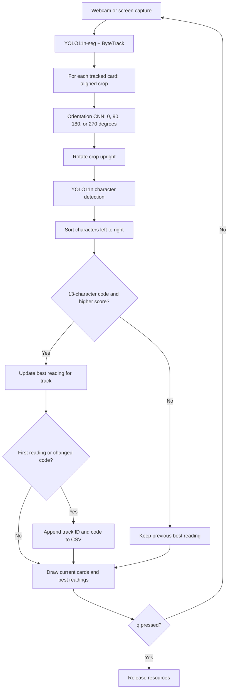

<div align="center">

# PTCG Code Reader

**Reading Pokémon TCG redemption codes with computer vision.**

A live vision pipeline that locates cards, corrects their orientation, detects individual characters, and keeps the best code reading for each tracked card.

**Python · PyTorch · YOLO11 · OpenCV · ByteTrack**

[Pipeline](#how-it-works) · [Quick start](#quick-start) · [Configuration](#configuration) · [Code structure](#code-structure)


<sub>Card segmentation, alignment, orientation correction, and character detection. Persistent tracking and best-reading selection connect readings across frames.</sub>

</div>

## Overview

Redemption cards can appear briefly in a camera feed, at an angle, or upside down. Reading their small alphanumeric codes requires more than locating a text region: the system must isolate the card, establish a consistent reading direction, and handle changing predictions across frames.

PTCG Code Reader combines two YOLO11 models with a custom PyTorch orientation classifier. It accepts a webcam or a screen capture, displays annotated cards, and appends accepted readings to a CSV file. All three trained model weights are included in this repository.

### What the project demonstrates

- **A complete inference pipeline:** instance segmentation, geometric alignment, orientation classification, and character detection work together in a continuous capture loop.
- **Temporal state management:** ByteTrack associates detections across frames, while the application retains the strongest accepted reading for each track.
- **Custom neural network integration:** a compact CNN resolves the four possible right-angle orientations before character recognition.
- **Modular application design:** model wrappers, capture, image processing, visualization, and logging have separate responsibilities. Context managers release capture devices, files, and display windows.

The application reads the printed code. It does not decode the QR code, submit codes, or check whether they can be redeemed.

## How it works



### 1. Locate and track cards

[`CardSegmenter`](models/card_segmenter.py) runs YOLO instance segmentation with `persist=True` and the bundled Ultralytics `bytetrack.yaml` configuration. Each tracked card includes a polygon, bounding box, class, confidence, and track ID. The default segmentation inference size is `448`.

### 2. Align the crop

[`crop_card`](frames/processing.py) fits a minimum-area rectangle to the segmentation polygon with `cv2.minAreaRect`. It uses an affine transform to rotate and translate the card directly into its crop, avoiding rotation of the entire frame. Invalid polygons or zero-sized rectangles are skipped.

This corrects in-plane tilt. It does not perform a four-corner perspective rectification.

### 3. Resolve orientation

[`CardOrientationClassifier`](models/card_orientation_classifier.py) converts the crop from BGR to RGB, resizes it to `64 × 64`, and applies a custom CNN. The predicted class determines the corrective rotation:

| Class ID | Clockwise rotation |
| :---: | :---: |
| `0` | 0° |
| `1` | 180° |
| `2` | 90° |
| `3` | 270° |

The network has **548,516 parameters**. It contains three `3 × 3` convolutional layers with 16, 32, and 64 output channels, each followed by ReLU and `2 × 2` max pooling. The resulting `64 × 8 × 8` features feed fully connected layers of 128 and 4 units.

### 4. Detect and assemble characters

[`CharacterDetector`](models/character_detector.py) runs the second YOLO model on the upright crop at a default inference size of `640`. Each detected class maps to a character through the model's class names. The application sorts detections by horizontal bounding-box center and concatenates their labels.

<p align="center">
  
  <br>
  <sub>Individual character detections on a code card. The live application draws card masks, track IDs, and accepted codes on the full frame.</sub>
</p>

### 5. Retain the strongest reading

[`CodeReader`](code_reader.py) accepts only strings of exactly **13 characters**, without adding separator hyphens. It calculates a ranking score as the product of the individual character detection confidences:

```text
reading_score = confidence_1 × confidence_2 × … × confidence_13
```

A new reading replaces the stored one only if its score is strictly higher. The displayed percentage represents this product, **not a calibrated probability that the whole code is correct**. Segmentation and orientation confidence do not contribute to this score.

The first accepted reading produces a log entry. A stronger reading with a different code produces another entry. A stronger reading with the same code updates the stored score without writing a duplicate row.

## Quick start

### Requirements

- Python **3.10 or newer** for the syntax used by this project, with a version supported by your chosen PyTorch build.
- A desktop session capable of opening an OpenCV window.
- A webcam, or a screen capture environment supported by MSS.
- Optional: a CUDA-capable GPU and a matching PyTorch installation. The application selects CUDA when `torch.cuda.is_available()` is true and otherwise uses CPU.

### 1. Clone and create an environment

```bash
git clone https://github.com/GabrielFJanu/ptcg-code-reader.git
cd ptcg-code-reader
python3 -m venv .venv
source .venv/bin/activate
python -m pip install --upgrade pip
```

On Windows, use `python` instead of `python3` and activate the environment with `.venv\Scripts\Activate.ps1` in PowerShell.

### 2. Install dependencies

Install `torch` and `torchvision` using the command generated by the [official PyTorch installation selector](https://pytorch.org/get-started/locally/) for your operating system and compute platform. Then install the remaining packages:

```bash
python -m pip install "ultralytics==8.3.228" opencv-python numpy Pillow mss "lap>=0.5.12"
```

The Ultralytics version above matches the metadata in both bundled YOLO checkpoints. `lap` supplies the assignment dependency used by tracking. Keep the GUI-enabled `opencv-python` package because the application calls `cv2.imshow`. See the [Ultralytics installation guide](https://docs.ultralytics.com/quickstart/) for platform-specific installation details.

This repository does not yet include a dependency lockfile or a validated environment matrix. Matching checkpoint metadata is a starting point, not a guarantee of compatibility with every Python, PyTorch, or operating-system version.

### 3. Check the model files

The following files are already tracked in the repository:

```text
weights/
├── card_segmenter.pt              # YOLO11n-seg
├── card_orientation_classifier.pth # Custom PyTorch CNN
└── character_detector.pt          # YOLO11n
```

No training step is required to run inference. The paths in [`config/config.py`](config/config.py) are relative to the working directory, so launch the application from the repository root.

### 4. Run

The default input is webcam `0`:

```bash
python main.py
```

Hold a code card in view with its printed characters readable. The application displays a yellow overlay while a tracked card has no accepted reading and a green overlay once it has one. The label shows the track ID, best code, and score. Press **`q`** while the OpenCV window has focus to exit.

To read cards visible on your screen, edit these settings before starting:

```python
# config/config.py
CAPTURE_SOURCE = "screen"
MONITOR_INDEX = 1
```

For MSS, monitor `1` is the first physical display and monitor `0` covers all displays. Keep the application's preview outside the captured area when possible to avoid capturing the preview itself. File paths, video URLs, and command-line flags are not supported input options in the current entry point.

## Output

By default, accepted code changes are appended to `card_codes_log.csv` in the working directory. The file has **no header** and contains `track_id,code` pairs:

```csv
1,ABC23456789XY
2,DEF34567892XZ
```

*Illustrative values only.*

The CSV is a change history, not a table of globally unique codes. A track can appear more than once when its accepted code changes. Tracking IDs belong to a run and may recur after restarting, while the existing file remains and receives new rows. For a separate session log, change `CARD_CODES_LOG_PATH` before launching.

## Configuration

All runtime settings live in [`config/config.py`](config/config.py). Restart the application after changing them.

| Setting | Default | Purpose |
| --- | --- | --- |
| `CAPTURE_SOURCE` | `"webcam"` | Choose `"webcam"` or `"screen"`. |
| `WEBCAM_INDEX` | `0` | Camera device index. |
| `MONITOR_INDEX` | `1` | Display to capture in screen mode. |
| `CARD_SEGMENTER_CONFIDENCE_THRESHOLD` | `0.5` | Minimum card detection confidence. |
| `CARD_SEGMENTER_INFERENCE_IMAGE_SIZE` | `448` | Segmentation inference image size. |
| `CARD_TRACKER_CONFIG` | `"bytetrack.yaml"` | Ultralytics tracker configuration. |
| `CHARACTER_DETECTOR_CONFIDENCE_THRESHOLD` | `0.5` | Minimum character detection confidence. |
| `CHARACTER_DETECTOR_INFERENCE_IMAGE_SIZE` | `640` | Character inference image size. |
| `CHARACTER_DETECTOR_IOU_THRESHOLD` | `0.8` | Character detection overlap threshold for NMS. |
| `FRAME_DISPLAY_SIZE` | `(840, 560)` | Preview width and height, independent of model input sizes. |
| `CARD_CODES_LOG_PATH` | `"card_codes_log.csv"` | Append-only output file. |

The same file defines the three model weight paths. The 13-character acceptance rule lives in `code_reader.py`, while the classifier's `64 × 64` input size and class-to-angle mapping live in `models/card_orientation_classifier.py`.

## Code structure

```text
ptcg-code-reader/
├── main.py                              # Application entry point
├── code_reader.py                       # Pipeline orchestration and best readings
├── config/
│   └── config.py                        # Paths and runtime settings
├── frames/
│   ├── capture.py                       # Webcam and screen capture interfaces
│   ├── processing.py                    # Affine cropping and right-angle rotation
│   ├── annotation.py                    # Card overlays and reading labels
│   └── display.py                       # OpenCV preview and keyboard handling
├── models/
│   ├── card_segmenter.py                # YOLO segmentation and tracking
│   ├── card_orientation_classifier.py   # CNN architecture and orientation inference
│   └── character_detector.py            # YOLO character detection
├── logs/
│   └── codes_log_writer.py              # Line-buffered CSV append writer
├── weights/                             # Three trained checkpoints
└── docs/images/                         # Pipeline and character detection examples
```

The model wrappers return typed data objects (`SegmentedCard`, `PredictedCardOrientation`, and `DetectedCharacter`). `CodeReader` turns these into `CardReading` objects and owns the best-reading dictionary, keeping application policy separate from model inference.

## Training background

The models were developed using a dataset of **more than 2,000 images** extracted from YouTube unboxing videos and controlled recordings, with bounding boxes and polygons annotated in Roboflow. The dataset used a **70% / 20% / 10%** train, validation, and test split and **24 alphanumeric character classes**.

Training used transfer learning for YOLO11n-seg and YOLO11n, random initialization for the orientation CNN, and AdamW optimization. Augmentation included blur, noise, geometric transforms, and downscaling.

This repository contains inference code and checkpoints, but no datasets, training scripts, or evaluation harness. Current end-to-end code accuracy and throughput remain to be measured.

## Limitations and next steps

- **Length is the only code-validity check.** A 13-character prediction can still be incorrect. There is no checksum, redemption check, or multi-frame voting.
- **Tracking is session-local.** A card that disappears and returns may receive a new ID. There is no global code deduplication, and stored track histories remain in memory for the duration of the run.
- **View quality matters.** Glare, small characters, occlusion, motion blur, and strong perspective distortion can affect the reading. The crop corrects tilt but not perspective.
- **Throughput depends on the scene and device.** Processing is sequential, with orientation and character inference for each tracked card on each frame. This repository does not claim a measured FPS target.

Useful next steps include a reproducible dependency lockfile, a labeled end-to-end evaluation set, temporal consensus for code selection, and explicit session identifiers in the log.

## Troubleshooting

| Symptom | What to check |
| --- | --- |
| Webcam fails to open | Try another `WEBCAM_INDEX`, check camera permissions, and close other applications using the camera. |
| Invalid monitor index | Select an available MSS monitor. `1` is the first physical display, and `0` is the combined desktop. |
| Screen capture fails or appears blank | Check OS screen-recording permissions and whether MSS supports capture in your desktop session. |
| OpenCV cannot open a window | Run in a graphical desktop session with GUI-enabled OpenCV. A headless environment cannot display this application's preview. |
| Model file is missing | Launch from the repository root and verify all three paths in `config/config.py`. |
| CUDA is not selected | Check `python -c "import torch; print(torch.cuda.is_available())"` and your PyTorch installation. CPU is the automatic fallback. |
| Cards remain yellow | Improve character visibility. A tracked card becomes green only after a 13-character reading passes the acceptance rule. |
| Repeated IDs or corrected codes appear in CSV | This is an append-only history. See [Output](#output) for session and update semantics. |

## Credits

Project by **Gabriel de Freitas** and **Ezequiel Junior**.

Built with Ultralytics YOLO, PyTorch, torchvision, OpenCV, NumPy, Pillow, and MSS. Roboflow supported the dataset annotation workflow.
