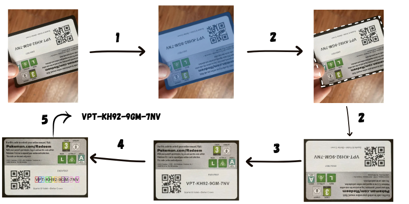
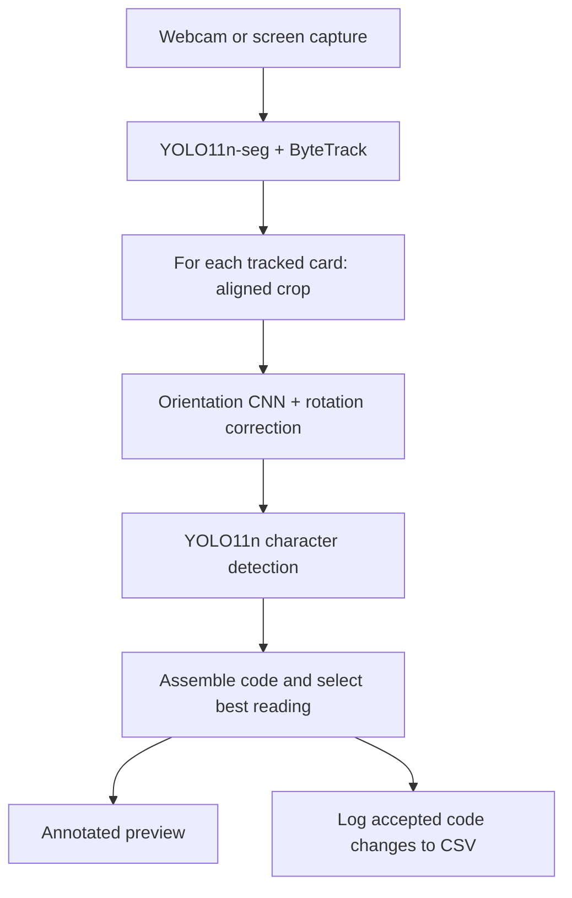
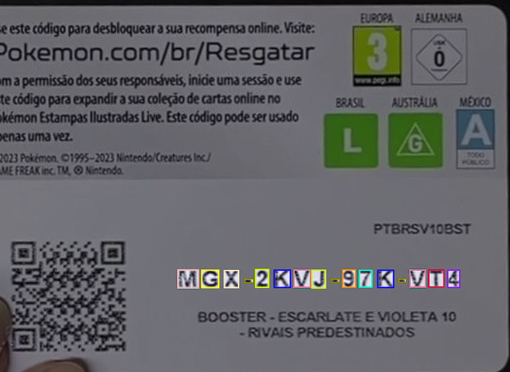

<div align="center">

# PTCG Code Reader

**Reading Pokémon TCG redemption codes with computer vision.**

A live vision pipeline that locates cards, corrects their orientation, detects individual characters, and keeps the best code reading for each tracked card.

**Python · PyTorch · YOLO11 · OpenCV · ByteTrack**

[Pipeline](#how-it-works) · [Quick start](#quick-start) · [Configuration](#configuration) · [Code structure](#code-structure)



<sub>Card segmentation, alignment, orientation correction, and character detection.</sub>

</div>

## Overview

Redemption cards can appear briefly in a camera feed, tilted or upside down. PTCG Code Reader isolates each card, corrects its orientation, and reads its printed code across successive frames.

The application combines two YOLO11 models with a custom PyTorch CNN. It accepts webcam or screen capture input, displays annotated cards, and saves accepted readings to CSV. **All three trained model weights are included.**

### Highlights

- **Persistent tracking** with ByteTrack and best-reading selection for each card.
- **Custom orientation CNN** with 548,516 parameters and four rotation classes.
- **Modular Python implementation** separating model inference, image processing, capture, and logging.

The application reads the printed code. It does not decode the QR code, submit codes, or check whether they can be redeemed.

## How it works



### 1. Locate and track cards

[`CardSegmenter`](models/card_segmenter.py) uses YOLO11n-seg to locate and segment each card, producing a polygon that outlines its shape for the alignment and cropping stage. ByteTrack associates the cards across frames.

### 2. Align the crop

[`crop_card`](frames/processing.py) fits a minimum-area rectangle to the segmentation polygon, then applies an affine transform to align its edges with the image axes and extract the card. This removes the card's in-plane tilt, but its rectangular outline alone cannot reveal which way the printed content should face. The aligned crop may still be sideways or upside down.

### 3. Resolve orientation

[`CardOrientationClassifier`](models/card_orientation_classifier.py) resolves this remaining ambiguity using the card's visual content. It processes a `64 × 64` crop and predicts a corrective rotation of **0°, 90°, 180°, or 270°**, which is applied before character detection. For example, an upside-down card can have perfectly aligned edges after cropping and still require a 180° rotation to make its code readable from left to right.

The CNN uses three convolutional blocks followed by two fully connected layers. Together, geometric alignment and orientation classification produce a consistently oriented input for character recognition.

### 4. Detect and assemble characters

[`CharacterDetector`](models/character_detector.py) uses YOLO11n to detect individual characters on the upright crop. The application reads them from left to right to assemble the code.

<p align="center">
  
  <br>
  <sub>Individual character detections on a code card.</sub>
</p>

### 5. Retain the strongest reading

[`CodeReader`](code_reader.py) accepts only strings of exactly **13 characters**, without adding separator hyphens. It calculates a ranking score as the product of the individual character detection confidences:

```text
reading_score = confidence_1 × confidence_2 × … × confidence_13
```

A reading replaces the stored one only if its score is strictly higher. The score ranks readings; it is not a calibrated probability of a correct code. The preview displays it as a decimal, such as `Score: 0.742`.

The CSV records the first accepted reading and subsequent code changes. Improving the score without changing the code does not add a row.

## Quick start

### Requirements

- Python **3.12+**, with wheels available for the pinned dependencies. [SciPy 1.18.1](https://pypi.org/project/scipy/1.18.1/) requires Python 3.12 or newer.
- A graphical desktop and a webcam or MSS-compatible screen capture environment.
- Optional: a CUDA-capable GPU. The application automatically selects CUDA when available and otherwise uses CPU.

### 1. Clone and create an environment

```bash
git clone https://github.com/GabrielFJanu/ptcg-code-reader.git
cd ptcg-code-reader
python3 -m venv .venv
source .venv/bin/activate
python -m pip install --upgrade pip
```

On Windows, use `python` instead of `python3` and activate the environment with `.venv\Scripts\Activate.ps1` in PowerShell.

### 2. Install dependencies

Install **PyTorch 2.11.0 and torchvision 0.26.0** for your platform using the [official installation instructions](https://pytorch.org/get-started/previous-versions/#v2110), choosing CPU or CUDA as appropriate. Then install the project dependencies:

```bash
python -m pip install -r requirements.txt
python -m pip check
```

[`requirements.txt`](requirements.txt) pins the project's dependencies to versions from a successful run. It accepts either CPU or CUDA builds of the specified PyTorch versions. These are tested versions, not minimum requirements or a complete transitive lockfile; other platforms have not been systematically tested.

### 3. Run

The trained weights are included under `weights/`:

```text
weights/
├── card_segmenter.pt               # YOLO11n-seg
├── card_orientation_classifier.pth # Custom PyTorch CNN
└── character_detector.pt           # YOLO11n
```

Run from the repository root. The default input is webcam `0`:

```bash
python main.py
```

Hold a code card in view with its printed characters readable. The application displays a yellow overlay while a tracked card has no accepted reading and a green overlay once it has one. The label shows the track ID, best code, and score. Press **`q`** while the OpenCV window has focus to exit.

To read cards visible on your screen, edit these settings before starting:

```python
# config/config.py
CAPTURE_SOURCE = "screen"
MONITOR_INDEX = 1
```

Monitor `1` is the first physical display; `0` covers all displays. Keep the preview outside the captured area when possible. Input is configured in Python, with no command-line flags or direct video-file/URL input.

## Output

By default, accepted code changes are appended to `card_codes_log.csv` in the working directory. The file has **no header** and contains `track_id,code` pairs:

```csv
1,ABC23456789XY
2,DEF34567892XZ
```

*Illustrative values only.*

The file preserves a history of code changes, so a track can have multiple rows. IDs are session-local and may recur after restarting. Change `CARD_CODES_LOG_PATH` to keep separate session logs.

## Configuration

Edit [`config/config.py`](config/config.py) to set input devices, model paths, thresholds, and output options. Restart the application after changes.

<details>
<summary>Configuration reference</summary>

| Setting | Default | Purpose |
| --- | --- | --- |
| `CAPTURE_SOURCE` | `"webcam"` | Choose `"webcam"` or `"screen"`. |
| `WEBCAM_INDEX` | `0` | Camera device index. |
| `MONITOR_INDEX` | `1` | Display to capture in screen mode. |
| `CARD_SEGMENTER_CONFIDENCE_THRESHOLD` | `0.5` | Minimum card detection confidence. |
| `CARD_SEGMENTER_INFERENCE_IMAGE_SIZE` | `448` | Segmentation inference image size. |
| `CARD_TRACKER_CONFIG` | `"bytetrack.yaml"` | Ultralytics tracker configuration. |
| `CHARACTER_DETECTOR_CONFIDENCE_THRESHOLD` | `0.5` | Minimum character detection confidence. |
| `CHARACTER_DETECTOR_INFERENCE_IMAGE_SIZE` | `640` | Character inference image size. |
| `CHARACTER_DETECTOR_IOU_THRESHOLD` | `0.8` | Character detection overlap threshold for NMS. |
| `FRAME_DISPLAY_SIZE` | `(840, 560)` | Preview width and height, independent of model input sizes. |
| `CARD_CODES_LOG_PATH` | `"card_codes_log.csv"` | Append-only output file. |

</details>

## Code structure

```text
ptcg-code-reader/
├── main.py                              # Application entry point
├── code_reader.py                       # Pipeline orchestration and best readings
├── config/
│   └── config.py                        # Paths and runtime settings
├── frames/
│   ├── capture.py                       # Webcam and screen capture interfaces
│   ├── processing.py                    # Affine cropping and right-angle rotation
│   ├── annotation.py                    # Card overlays and reading labels
│   └── display.py                       # OpenCV preview and keyboard handling
├── models/
│   ├── card_segmenter.py                # YOLO segmentation and tracking
│   ├── card_orientation_classifier.py   # CNN architecture and orientation inference
│   └── character_detector.py            # YOLO character detection
├── logs/
│   └── codes_log_writer.py              # CSV output
├── weights/                             # Three trained checkpoints
└── docs/images/                         # Pipeline and character detection examples
```

## Training background

The models were developed using a dataset of **more than 2,000 images** extracted from YouTube unboxing videos and controlled recordings, with bounding boxes and polygons annotated in Roboflow. The dataset used a **70% / 20% / 10%** train, validation, and test split and **24 alphanumeric character classes**.

Training used transfer learning for YOLO11n-seg and YOLO11n, random initialization for the orientation CNN, and AdamW optimization. Augmentation included blur, noise, geometric transforms, and downscaling.

This repository contains inference code and checkpoints, but no datasets, training scripts, or evaluation harness. Current end-to-end code accuracy and throughput remain to be measured.

## Limitations

- **Code validation:** length alone does not guarantee a correct reading. There is no checksum or multi-frame voting.
- **Tracking:** a returning card may receive a new ID. Codes are not globally deduplicated.
- **Image quality:** glare, blur, occlusion, and small text affect recognition. Alignment corrects tilt, not perspective distortion.
- **Performance:** processing is sequential, so throughput depends on hardware and the number of visible cards.

## Troubleshooting

<details>
<summary>Common setup and capture issues</summary>

| Symptom | What to check |
| --- | --- |
| Webcam fails to open | Try another `WEBCAM_INDEX`, check camera permissions, and close other applications using the camera. |
| Invalid monitor index | Select an available MSS monitor. `1` is the first physical display, and `0` is the combined desktop. |
| Screen capture fails or appears blank | Check OS screen-recording permissions and whether MSS supports capture in your desktop session. |
| OpenCV cannot open a window | Run in a graphical desktop session with GUI-enabled OpenCV. A headless environment cannot display this application's preview. |
| Model file is missing | Launch from the repository root and verify all three paths in `config/config.py`. |
| CUDA is not selected | Check `python -c "import torch; print(torch.cuda.is_available())"` and your PyTorch installation. CPU is the automatic fallback. |
| Cards remain yellow | Improve character visibility. A tracked card becomes green only after a 13-character reading passes the acceptance rule. |
| Repeated IDs or corrected codes appear in CSV | This is an append-only history. See [Output](#output) for session and update semantics. |

</details>

## Credits

Project by **Gabriel de Freitas Januário** and **Ezequiel Junior**.

Built with Ultralytics YOLO, PyTorch, torchvision, OpenCV, NumPy, Pillow, and MSS. Roboflow supported the dataset annotation workflow.
